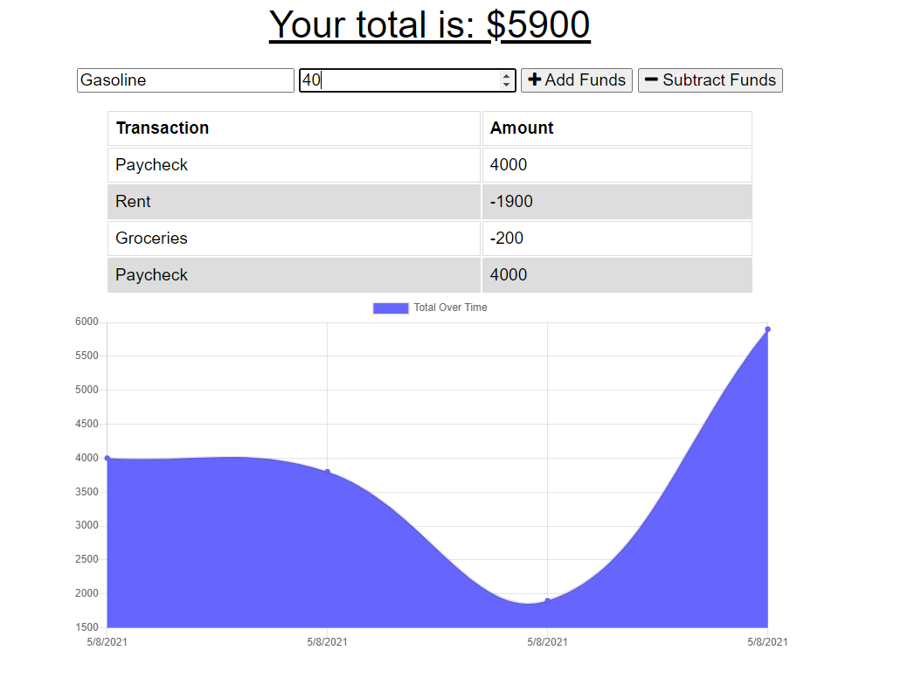

# The Budget Tracker

  ## Description

  This is a progressive web application built to help normal people track their Budget. As people we get busy and need to be able to track out expenses. The budget tracker provides an easy way to track your budget from transaction to transaction. Even if your internet goes offline the budget tracker should be able to keep your transactions until your connection is restored.

  ## Table of Contents

  * [Installation](#installation)
  * [Usage](#usage)
  * [License](#license)
  * [Contributors](#contributors)
  * [Questions](#questions?)
  * [Tests](#tests)

  ## Installation

  Go to the [deployed app](https://fierce-lake-02497.herokuapp.com/)

  ## Usage

  When you are on the application you will have the ability to add funds or subtract funds for each transaction. You must include the name of the transaction and the amount with each update. The graph will then track your funds over time to help you keep track of how much money you have available. If you go offline you can continue to use the program, when you come back online hit refresh to update.

  

  ## License

  

  ## Contributors

  N/A

  ## Questions?
  Follow me on Github
  [wmccone](https://github.com/wmccone) 
  or 
  email me at gerrymccone88@gmail.com

  ## Tests

  N/A

